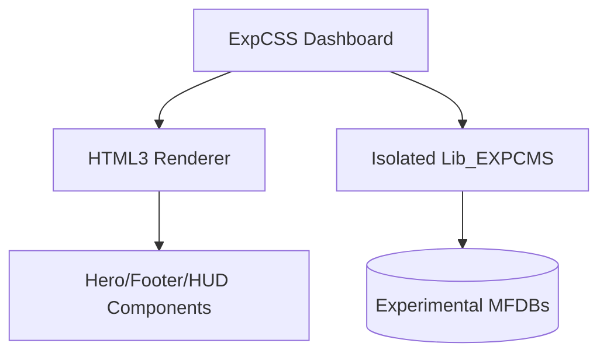

# Experimental_CMS [Agent-Ready] [Experimental]
> Research & Development platform for HTML3 and modular CMS UI patterns.

Experimental_CMS is a sandbox environment for testing high-density administrative dashboards and modular section components. It utilizes an isolated fork of the BEJSON library stack to ensure that cutting-edge UI experiments never compromise the stability of production CMS instances.

## 🚀 One-Liner
```bash
python3 ExpCSS_CMS.py
```

## 🏗️ Architecture


## 🛠️ Tech Stack
- **Backend**: Flask (Python 3.10+)
- **Database**: MFDB v1.31
- **Styling**: HTML3 Layout / BECSS
- **Components**: Reusable sections (Hero, HUD, Status Feed)

## 📂 Project Structure
- `Components/`: Modular sections for rapid site assembly.
- `Lib_EXPCMS/`: Dedicated internal library stack for experimental features.
- `HTML_Skeletons/`: Base templates for public-facing content.
- `Data/`: Local workspace containing experimental databases.

## 📄 Documentation
- [DECOMPOSITION_RECIPE.md](./DECOMPOSITION_RECIPE.md): Architectural blueprint and component breakdown.

---
*Author: Elton Boehnen*
*Github: [boehnenelton](https://github.com/boehnenelton)*
