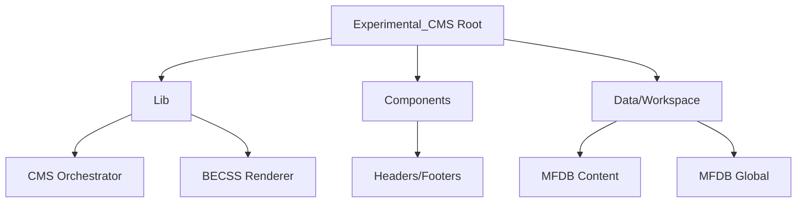

# BEJSON Experimental CMS (Experimental_CMS_2)
> Advanced Multi-Tenant CMS Engine with Dynamic Component Rendering.

  

## Overview
Experimental_CMS_2 is the bleeding-edge iteration of the BEJSON content management ecosystem. It introduces a modular component architecture, allowing for hot-swappable headers, footers, and body sections mapped to MFDB backend entities.

## Visual Architecture


## Quick Start
```bash
# Initialize and build a local site
python3 ExpCSS_CMS.py
```

## Core Innovation
- **Modular Components**: Template-driven HTML sections stored in `/Components`.
- **Dual MFDB Workspaces**: Separation of `db_content` (pages/apps) and `db_global` (nav/config).
- **AX-Ready**: Native support for agentic content ingestion and automated layout calibration.

## Documentation
- [AGENTS.md](./AGENTS.md) — Operational constraints.
- [ExperimentalCMS Bugs.md](./ExperimentalCMS%20Bugs.md) — Known issues and tracker.

---
**Elton Boehnen** · eltonboehnen@gmail.com · [github.com/boehnenelton](https://github.com/boehnenelton)
